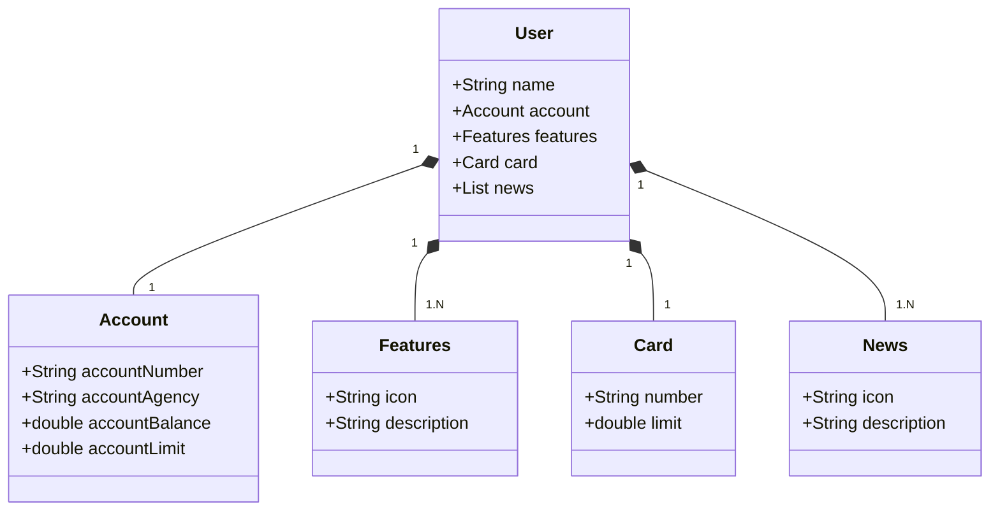

# Santander BootCampo Java 2024
Java RESTful API criada para a conclusão do BootCamp.

## Diagrama de Classes

```mermaid
classDiagram
    class User {
        +String name
        +Account account
        +Features features
        +Card card
        +List<News> news
    }

    class Account {
        +String accountNumber
        +String accountAgency
        +double accountBalance
        +double accountLimit
    }

    class Features {
        +String icon
        +String description
    }

    class Card {
        +String number
        +double limit
    }

    class News {
        +String icon
        +String description
    }

    User "1" *-- "1" Account
    User "1" *-- "1.N" Features
    User "1" *-- "1" Card
    User "1" *-- "1.N" News
```
